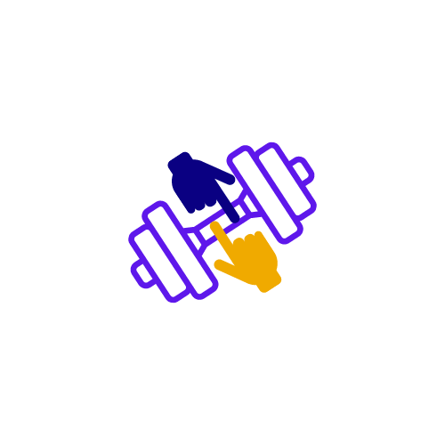

#  SportConnect

## Table of contents

-   [Introduction](#introduction)
-   [Technologies](#technologies)
-   [Features](#features)
-   [API(s)](#apis)

## Introduction

SportConnect is an app where the user can create his own workouts with a list of exercises and share it to his friends.
You can use the app with this [Link](https://sport-connect.onrender.com/)

## Technologies

Project is created with :

-   React
-   Tailwind

## Features

-   Login/SignUp
-   Create/Edit/Delete a workout
-   Edit Profile
-   Create a feed post
-   Subscribe to people

## APIs

-   [Node Express Server](https://github.com/Nqbral/sport-connect-api)
